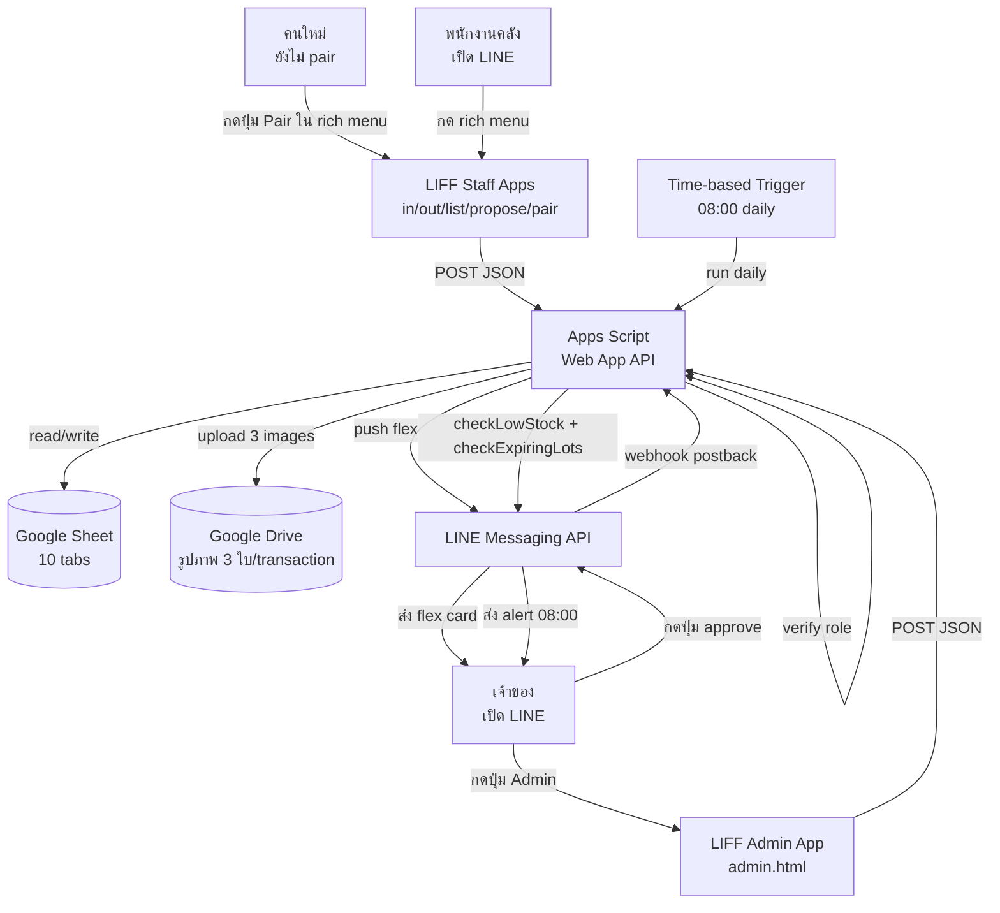

# Architecture — Stock App (คลังวัตถุดิบ)

> **อ่านก่อน:** [CONTEXT.md](../CONTEXT.md) · [CLAUDE.md](../CLAUDE.md)

---

## 1. ภาพรวมระบบ



---

## 2. Data Flow — 7 flows หลัก

### Flow A: Pairing (จับคู่บัญชี LINE)
| # | Step | ใครทำ | ข้อมูล | ปลายทาง |
|---|---|---|---|---|
| 1 | กด rich menu "เริ่มใช้งาน" | คนใหม่ | — | LIFF pair.html |
| 2 | ระบบ get LIFF profile | LIFF | userId | LIFF |
| 3 | check `/me` → "ยังไม่ pair" | LIFF → APPS | userId | APPS |
| 4 | แสดงปุ่ม "คัดลอก User ID" + form ใส่ code | LIFF | userId | user |
| 5 | (คู่ขนาน) Owner เปิด admin → เพิ่มชื่อ + role → generate code | Admin LIFF | name, role | APPS |
| 6 | Owner ส่ง code 6 หลักให้พนักงาน via LINE | manual | — | — |
| 7 | พนักงานใส่ code → submit | LIFF | code, userId | APPS `redeemPairing` |
| 8 | APPS verify + insert User_Map | APPS | row | Sheet |
| 9 | APPS reply success → LIFF redirect rich menu | APPS | success | LINE |

### Flow B: รับสารเข้า (Goods In)
| # | Step | ใครทำ | ข้อมูล | ปลายทาง |
|---|---|---|---|---|
| 1 | กด rich menu "รับเข้า" | Staff | — | LIFF in.html |
| 2 | เลือกสาร (autocomplete จาก `Materials`) | Staff | material_id | LIFF |
| 3 | กรอก lot_no, qty, supplier, expire_date | Staff | form | LIFF |
| 4 | ถ่ายรูปสด 3 ใบ (camera.js + stamp) | Staff | base64 × 3 | LIFF |
| 5 | submit | LIFF | JSON + 3 base64 | APPS `receiveMaterial` |
| 6 | verify isPairedStaff | APPS | — | — |
| 7 | upload 3 รูปไป Drive `/Stock/<YYYY-MM>/in/` | APPS | base64 → URL | Drive |
| 8 | insert `Inventory_Lots` (lot_id + qty_initial + qty_remaining) | APPS | row | Sheet |
| 9 | insert `Movements` (type=in, image URLs × 3) | APPS | row | Sheet |
| 10 | reply success → push flex receipt → Owner | APPS | flex card | LINE → Owner |

### Flow C: เบิกสารออก (Goods Out)
| # | Step | ใครทำ | ข้อมูล | ปลายทาง |
|---|---|---|---|---|
| 1 | กด rich menu "เบิกออก" | Staff | — | LIFF out.html |
| 2 | เลือกสาร | Staff | material_id | LIFF |
| 3 | ระบบ show lots คงเหลือ (sort by expire ASC = FIFO suggest) | LIFF → APPS | material_id | APPS `getLotsForMaterial` |
| 4 | Staff เลือก lot (override FIFO ได้) | Staff | lot_id | LIFF |
| 5 | กรอก qty + note (เช่น "ให้ RD-สมชาย") | Staff | form | LIFF |
| 6 | ถ่ายรูปสด 3 ใบ | Staff | base64 × 3 | LIFF |
| 7 | submit | LIFF | JSON + 3 base64 | APPS `issueMaterial` |
| 8 | verify + qty ≤ lot.qty_remaining | APPS | — | — |
| 9 | upload 3 รูปไป Drive `/Stock/<YYYY-MM>/out/` | APPS | URL | Drive |
| 10 | update `Inventory_Lots.qty_remaining -= qty` | APPS | row | Sheet |
| 11 | insert `Movements` (type=out, for_user_note, images) | APPS | row | Sheet |
| 12 | reply success → push flex receipt → Owner | APPS | flex card | LINE → Owner |

### Flow D: ดูสต๊อกคงเหลือ (List Stock)
| # | Step | ใครทำ | ข้อมูล | ปลายทาง |
|---|---|---|---|---|
| 1 | กด rich menu "สต๊อก" | Staff/Owner | — | LIFF list.html |
| 2 | call `listStock` | LIFF | filter? | APPS |
| 3 | aggregate qty_remaining per material | APPS | — | Sheet |
| 4 | mark สาร "ใกล้หมด" (qty < min_stock) + "ใกล้หมดอายุ" (any lot expire ≤ 30d) | APPS | — | — |
| 5 | return list (sorted: ใกล้หมดอายุ → ใกล้หมด → ปกติ) | APPS | array | LIFF |
| 6 | LIFF render: row per material พร้อม badge | LIFF | — | UI |
| 7 | Tap row → expand lots (lot_no, qty, expire, supplier) | LIFF | material_id | APPS `getLotsForMaterial` |

### Flow E: เสนอสารใหม่ (Propose Material)
| # | Step | ใครทำ | ข้อมูล | ปลายทาง |
|---|---|---|---|---|
| 1 | กด rich menu "เสนอสาร" | Staff | — | LIFF propose.html |
| 2 | กรอก name, unit, min_stock, note | Staff | form | LIFF |
| 3 | submit | LIFF | JSON | APPS `proposeMaterial` |
| 4 | insert `Pending_Changes` (status=pending) | APPS | row | Sheet |
| 5 | push flex card "มีคำขออนุมัติ" → Owner | APPS | flex + 2 buttons | LINE → Owner |
| 6 | Owner กด Approve | Owner | postback | webhook |
| 7 | APPS insert `Materials` (status=active) + update Pending = approved | APPS | rows | Sheet |
| 8 | reply Owner success + push Staff "สารของคุณได้รับอนุมัติ" | APPS | flex | LINE |

### Flow F: Admin (Owner LIFF)
| # | Step | ใครทำ | ข้อมูล | ปลายทาง |
|---|---|---|---|---|
| 1 | กดปุ่ม Admin (rich menu สีเข้ม) | Owner | — | LIFF admin.html |
| 2 | verify isOwner | LIFF → APPS | — | APPS |
| 3 | tab "พนักงาน" → เพิ่มชื่อ + role → submit | Owner | name, role | APPS `addEmployee` |
| 4 | tab "สร้างรหัสจับคู่" → เลือก emp → generate 6 digits | Owner | emp_code | APPS `issuePairingCode` |
| 5 | tab "อนุมัติสารใหม่" → list pending → approve/reject | Owner | pending_id | APPS `approveMaterial` |
| 6 | tab "ตั้งค่า min_stock" → list materials → edit | Owner | material_id, min_stock | APPS `updateMinStock` |
| 7 | tab "ดู audit" → list latest movements | Owner | filter | APPS `listMovements` |

### Flow G: Alert (Daily 08:00)
| # | Step | ใครทำ | ข้อมูล | ปลายทาง |
|---|---|---|---|---|
| 1 | trigger fire | Apps Script | — | — |
| 2 | `checkLowStock`: find materials where total qty_remaining < min_stock | APPS | — | Sheet |
| 3 | `checkExpiringLots`: find lots where expire_date ≤ today + 30d | APPS | — | Sheet |
| 4 | merge results → flex carousel | APPS | items | — |
| 5 | push flex → Owner (all owner_line_user_ids) | APPS | flex | LINE |

---

## 3. Sheet Structure

ดู [CONTEXT.md § 4 Data Model](../CONTEXT.md#4-data-model)

**สรุป 10 sheet:**
1. `Employees` (project)
2. `User_Map` (foundation pattern)
3. `Pairing_Codes` (foundation pattern)
4. `Materials` (project · catalog)
5. `Inventory_Lots` (project · stock)
6. `Movements` (project · transactions)
7. `Pending_Changes` (foundation pattern · approval queue)
8. `Audit_Log` (foundation pattern · auto by router)
9. `Logs` (foundation · error log)
10. `Config` (foundation · settings)

---

## 4. Drive Structure

```
/Stock/                                  # root (DRIVE_FOLDER_ID)
├── 2026-05/
│   ├── in/                              # รูปรับเข้า
│   │   ├── MOV-20260515-0001_1.jpg
│   │   ├── MOV-20260515-0001_2.jpg
│   │   └── MOV-20260515-0001_3.jpg
│   └── out/                             # รูปเบิกออก
│       ├── MOV-20260515-0002_1.jpg
│       └── ...
└── 2026-06/
    └── ...
```

**Permission:** anyone with link (เพราะ Flex Message thumbnail ต้องเข้าถึงได้)

---

## 5. Setup Plan

### Day 1 — Morning
- [ ] **Step 1** (พี่ปุ้ย, 5 นาที): สร้าง Google Sheet เปล่า · ตั้งชื่อ "Stock App DB" → copy SHEET_ID
- [ ] **Step 2** (พี่ปุ้ย, 5 นาที): สร้าง Drive folder ชื่อ "Stock" → copy DRIVE_FOLDER_ID
- [ ] **Step 3** (Claude Code, 30 นาที): clone foundation + setup clasp + push
- [ ] **Step 4** (พี่ปุ้ย, 1 นาที): Apps Script editor → Script Properties → ใส่ SHEET_ID + DRIVE_FOLDER_ID
- [ ] **Step 5** (พี่ปุ้ย, 1 นาที): รัน `setupDatabase()` → สร้าง 10 sheets
- [ ] **Step 6** (พี่ปุ้ย, 1 นาที): รัน `seedConfig()` → ใส่ค่า default
- [ ] **Step 7** (พี่ปุ้ย, 1 นาที): รัน `setupDrive()` → สร้าง subfolders
- [ ] **Step 8** (พี่ปุ้ย, 10 นาที): สร้าง LINE Messaging API channel → copy ACCESS_TOKEN + SECRET → ใส่ใน Script Properties
- [ ] **Step 9** (พี่ปุ้ย, 15 นาที): สร้าง 6 LIFF apps ใน LINE Developers (placeholder URL ก่อน)

### Day 1 — Afternoon
- [ ] **Step 10** (Claude Code, 4 ชม.): build Apps Script flows (Pairing/Stock/Material/Alert)
- [ ] **Step 11** (Claude Code, 2 ชม.): build LIFF frontend (in/out/list/propose/pair/admin/myid)

### Day 2 — Morning
- [ ] **Step 12** (Claude Code, 1 ชม.): build FlexCard.gs + Alert.gs + test functions
- [ ] **Step 13** (Claude Code, 1 ชม.): สร้าง rich menu image + setup_rich_menu.py
- [ ] **Step 14** (พี่ปุ้ย, 5 นาที): GitHub repo + Pages enable + push initial code
- [ ] **Step 15** (พี่ปุ้ย, 2 นาที): Apps Script → Deploy → New deployment → Web app → Anyone → copy URL
- [ ] **Step 16** (พี่ปุ้ย, 5 นาที): update `liff/js/config.js` API_URL + 6 LIFF_IDs → push GitHub
- [ ] **Step 17** (พี่ปุ้ย, 5 นาที): update 6 LIFF endpoint URLs ใน LINE Developers
- [ ] **Step 18** (พี่ปุ้ย, 2 นาที): set LINE webhook URL = Web App URL
- [ ] **Step 19** (พี่ปุ้ย, 5 นาที): รัน `setup_rich_menu.py` → upload rich menu

### Day 2 — Afternoon
- [ ] **Step 20** (พี่ปุ้ย + ทีม, 2 ชม.): inventory count + กรอกยอดยกมาผ่าน LIFF in.html (transactions แรก)
- [ ] **Step 21** (พี่ปุ้ย + ทีม, 1 ชม.): train หัวหน้าคลัง + ลูกน้อง

---

## 6. Edge Cases

| สถานการณ์ | วิธีรับมือ | implement ที่ |
|---|---|---|
| คนใหม่เปิด LIFF | redirect ไป pair.html + แสดงปุ่ม Copy User ID | auth.js → main.js |
| LINE userId ลงทะเบียนซ้ำ | block + แจ้ง "บัญชี LINE นี้ใช้แล้ว" | Pairing.gs |
| ใส่ pairing code ผิด | นับ failed_attempts · ≥5 = invalidate | Pairing.gs |
| Pairing code หมดอายุ | daily trigger expire + บอก "code หมดอายุ ขอใหม่" | Pairing.gs |
| Apps Script timeout 6 นาที | upload 3 รูป sequential + resize ก่อน base64 (max 1MB/รูป) | utils.js |
| LINE push fail | retry 3 ครั้ง exponential backoff | LineApi.gs |
| Drive URL `/view` แสดง HTML | แปลง → `/thumbnail?id=ID&sz=w800` | FlexCard.gs |
| ใช้รูปเก่าหลอก | บังคับ getUserMedia + stamp timestamp | camera.js |
| เบิก qty มากกว่าคงเหลือ | block + แสดง "เหลือ X เท่านั้น" | Stock.gs |
| ลบสาร (soft) แต่ยังมี lot | block + บอก "ยังมี lot คงเหลือ ลบไม่ได้" | Material.gs |
| 2 staff เปิด lot เดียวกันพร้อมกัน | last-write-wins (Sheet) + เตือนว่ามีคนเบิกไปก่อน (re-fetch) | Stock.gs |
| Day-1 ไม่มียอดยกมา | กรอกผ่าน in.html ครั้งแรก = "ยกมา" (note อ่านเองว่ายกมา) | manual workflow |
| 6 นาที timeout ตอน list ใหญ่ | cache list + pagination | Stock.gs |
| Owner ทำตัวเองเป็น staff | rich menu owner เห็นทุกปุ่ม + admin button | RichMenu |

---

## 7. Next Steps (หลัง MVP deploy)

- [ ] Sprint 2: เพิ่ม Reorder Point + auto-suggest supplier
- [ ] Sprint 3: เชื่อมกับ RD App (BOM)
- [ ] Sprint 4: เชื่อมกับ Production App (auto-deduct ตามสูตร)
- [ ] Sprint 5: Multi-warehouse (ถ้ามีคลังที่ 2)
- [ ] Sprint 6: Migrate ไป Supabase (ถ้า Sheet เริ่มช้า)
